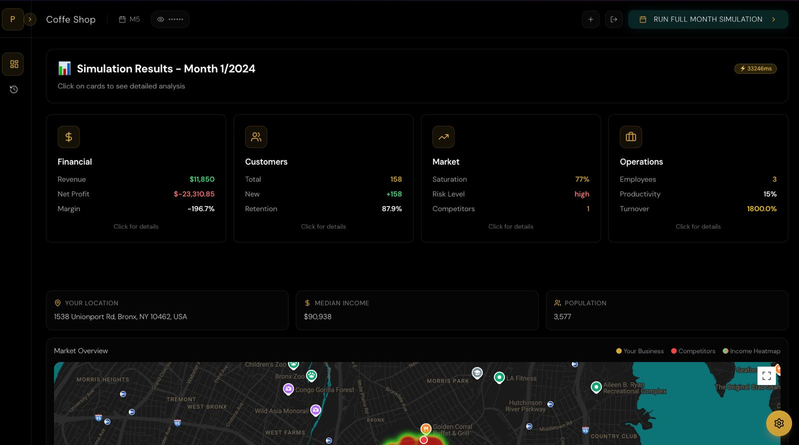
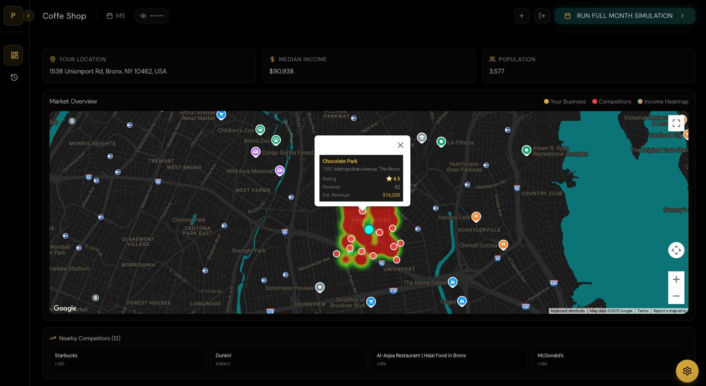
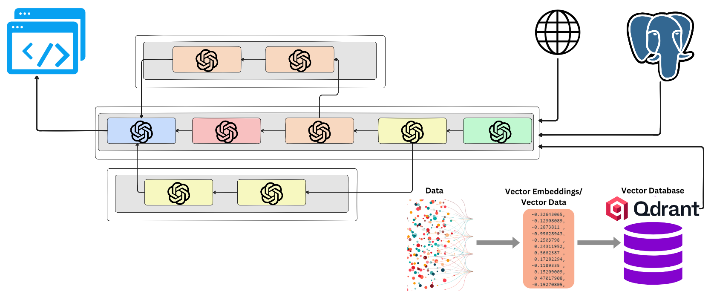
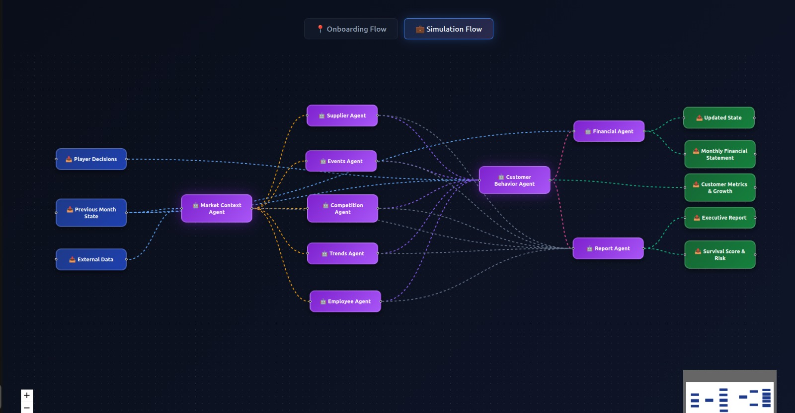
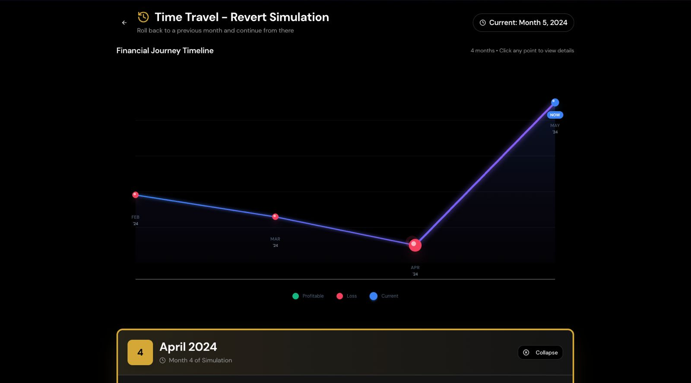
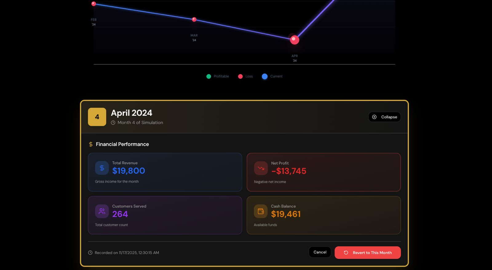

# PROXITY - NYC Business Simulator

**Built by:**
- [@floreaGabriel](https://github.com/floreaGabriel) - Core Development
- [@tavigingu](https://github.com/tavigingu) - Core Development
- [@SabinGhost19](https://github.com/SabinGhost19) - Core Development
- [@lucaapahidean](https://github.com/lucaapahidean) - Data Extraction, Aggregation & ML Analysis
- [@Nicky261](https://github.com/Nicky261) - Data Extraction, Aggregation & ML Analysis

---

PROXITY is an AI-driven business simulation platform that models entrepreneurial scenarios in New York City's market. The system integrates US Census demographic data, real-time market trends, and 9 specialized AI agents executing in parallelized phases to deliver monthly performance forecasts and strategic recommendations.

  

## Table of Contents

1. [Overview](#overview)
2. [Architecture](#architecture)
3. [Business Logic](#business-logic)
4. [Agent Pipeline](#agent-pipeline)
5. [Workflow](#workflow)
6. [Use Cases](#use-cases)

---

## Overview

The application allows users to:

- Authenticate and create simulation sessions
- Select a location on an interactive map (NYC)
- Configure business parameters (type, budget, pricing, quality)
- Simulate monthly performance using 12 AI agents
- Analyze competition, customer behavior, and financial metrics
- Receive detailed reports with strategic recommendations
- Track business evolution over time

**Performance**: A complete month of business is simulated in approximately 10 seconds.

---

## Architecture

### Main Components

**Frontend** - React + Vite + TypeScript
- SPA with route-based navigation
- Location selector with Mapbox
- Interactive dashboard with charts and metrics
- Decision panel for player input

## Dashboard:

## Competition-HeatMap:

**Backend** - FastAPI + Python
- REST API for data retrieval
- US Census API integration (ACS 2021/2022)
- Google Trends API integration
- PostgreSQL database management
- Authentication and session management

**Agents Orchestrator** - Next.js + TypeScript
- API routes for agent coordination
- Parallelized execution of independent agents
- OpenAI GPT-4/GPT-4-mini integration
- Mathematical models without LLM
- RAG service for historical context

**Data Storage**
- PostgreSQL: Relational data (users, sessions, census, states)
- Qdrant: Vector embeddings for RAG and semantic search

### Technology Stack

**Frontend**: React 18, Vite, TanStack Query, React Router, Mapbox GL JS, Recharts, Tailwind CSS, shadcn/ui

**Backend**: FastAPI, SQLAlchemy, PostgreSQL 15, Pydantic, httpx

**Orchestrator**: Next.js 14, OpenAI SDK, Vercel AI SDK, Zod, Qdrant Client

**Infrastructure**: Docker Compose, PostgreSQL container, Qdrant container

---

## Business Logic

### Simulation Workflow

The simulation operates on a monthly cycle where each month (30 virtual days) is condensed into a 10-second process.

### Business Initialization

Configuration steps:
1. User selects exact location (lat/lng) in NYC
2. System retrieves Census data (demographics, income, education, housing)
3. User configures:
   - Business type (restaurant, coffee shop, retail, gym, salon)
   - Initial budget
   - Pricing strategy (discount, competitive, premium)
   - Quality level (basic, standard, premium)
   - Marketing budget
   - Employee count

### Monthly Cycle

Each month, the system:
1. Retrieves historical context from database
2. Executes the 9-agent pipeline in 6 parallelized phases
3. Aggregates results into financial statements
4. Generates narrative report with insights
5. Saves state to database for next month

### Economic Models

**Bass Diffusion Model** - New customer acquisition
- Models adoption over time with innovation (p) and imitation (q) coefficients

**Huff Gravity Model** - Market share and competition impact
- Incorporates store attractiveness and distance decay

**Dynamic Market Penetration** - Addressable market
- Factors: population density, income elasticity, seasons, business type

**Churn Rate Calculation** - Customer loss rate
- Base industry churn + quality impact + price sensitivity + competition pressure

---

## Agent Pipeline

The multi-agent system contains 9 specialized agents executed in 6 parallelized phases:

### Phase 0: RAG Retrieval (0.5s)
- Loads historical context from vector database
- Uses semantic search for similar past months
- Provides learned patterns for better decision-making

### Phase 1: Market Context Agent (1s)
**Model**: GPT-4-mini

Analyzes macro-economic conditions using Census, survival rates, Google Trends, seasonal factors.

**Output**: Economic climate score, industry saturation, market demand score, seasonal multiplier

### Phase 2: External Analysis - Parallel (2s)

**Events Agent** (GPT-4)
- Generates realistic economic/social events
- Output: Event name, customer impact (-50% to +50%), business relevance
- Examples: Winter storm (-25%), Street festival (+40%), New subway line (+15%)

**Trends Agent** (GPT-4)
- Analyzes Google Trends patterns
- Output: Trend impact score, market momentum, trend interpretation

### Phase 3: Market Dynamics - Parallel (1.5s)

**Supplier Agent** (GPT-4-mini)
- Calculates operating costs (rent, utilities, COGS)
- Uses Census rent data + seasonal utility formulas
- Output: Monthly rent, utilities, COGS percentage, total costs

**Competition Agent** (GPT-4-mini)
- Models competitive landscape with Huff Gravity Model
- Output: Competitor count, pricing pressure, market space, competitive advantages

**Employee Agent** (Pure Math - no LLM)
- Calculates workforce metrics
- Output: Total employees, productivity score, morale, labor cost
- Factors: wage impact, turnover rate (5-15% monthly)

### Phase 4: Customer Simulation (2s)
**Model**: GPT-4-mini + Pure Math

Simulates customer acquisition, retention, and revenue using:
- Bass Diffusion for new customers
- Dynamic churn rate
- Customer segmentation
- Revenue calculation

**Output**: New customers, retention, churn rate, active customers, revenue, avg transaction value

### Phase 5: Financial Analysis - Parallel (3s)

**Financial Agent** (Pure Math - no LLM)
- Calculates P&L and cash flow
- Output: Profit & Loss Statement, Cash Flow, Financial Health Metrics
- Metrics: Revenue growth, profit growth, cash runway, health score (0-100)

**Report Agent** (GPT-4 + RAG Context)
- Generates comprehensive narrative report
- Output: Executive summary, key insights, warnings, opportunities, recommendations

### Phase 6: RAG Storage (0.2s)
- Converts state to text summary
- Generates embedding with OpenAI
- Stores in Qdrant with metadata
- Enables future semantic retrieval

## Core Pipeline: 

---

## Workflow

### 1. Authentication and Registration

User registers with username → Backend creates user in PostgreSQL → Frontend stores user_id in localStorage

### 2. Business Setup and Session Creation

User completes business details (name, type, location, budget) → Backend creates session in PostgreSQL → Frontend stores session in localStorage

### 3. Monthly Simulation Execution

**Complete flow**:

Frontend sends simulation request → Backend retrieves previous month's state from DB → Backend calls Orchestrator with all data

Orchestrator executes:
- Phase 0: RAG Retrieval (query Qdrant for historical context)
- Phase 1: Market Context (macro-economic analysis)
- Phase 2: Events + Trends (parallel)
- Phase 3: Supplier + Competition + Employee (parallel)
- Phase 4: Customer Simulation
- Phase 5: Financial + Report (parallel)
- Phase 6: RAG Storage (save to Qdrant)

Backend receives results → Frontend receives results and displays them → Frontend saves state to DB

### 4. Data Persistence

**PostgreSQL**: Stores users, sessions, monthly states, census data cache

**Qdrant**: Stores embeddings for RAG (business_id, session_id, month, year, summary, metrics)

---

## Use Cases ( our mascot: Riri aka Riru )

### 1. First-Time Entrepreneur

Riri wants to open a coffee shop in Brooklyn:
- Selects Williamsburg location
- System shows: Population 8,500, median income $75,000, education 65%+
- Configures: $100k budget, premium pricing, premium quality
- Month 1 simulation: 320 customers, $12,800 revenue, $3,300 profit

**Insights**: Demographics support premium pricing, good traffic, moderate competition

### 2. Multi-Month Strategy

Riri tests different strategies for his restaurant (month 3):
- Test 1: Lower prices + increase marketing → +25% customers, -5% profit margin
- Test 2: Keep premium prices + reduce marketing → -10% customers, +12% profit margin  
- Test 3: Hire more staff → +15% customers, +20% revenue, +8% profit

**Decision**: Chooses Test 3 for optimal growth

### 3. Competitive Analysis

Riri discovers why her gym is underperforming:
- Competitors: 18 (HIGH saturation)
- Churn rate: 18% (industry avg: 12%)
- Adjusts: reduces price to $55, increases quality, adds referral program
- Result: Churn 14%, +30% new customers, +15% revenue

### 4. Seasonal Planning

Riri prepares retail store for holiday season:
- Events Agent: Black Friday +45%, holiday season +30%
- Trends Agent: +120% search volume
- Adjusts: abundant inventory, +3 temporary employees, $3,500 marketing
- December: $42,000 revenue vs $18,000 in October

### 5. Roll-Back Option:

Riri application includes a powerful time-travel feature that allows users to revert their business to any previous month:

**How it works**:
- Every monthly simulation state is automatically saved to the database
- Users can access the "Revert" page from the dashboard
- Select any previous month from a dropdown list
- System restores complete business state including:
  - Revenue and profit metrics
  - Customer count
  - Cash balance
  - Employee configuration
  - Inventory levels
  - All agent outputs and decisions

**Use Case Example**:

Riri made risky decisions in Month 5 (aggressive pricing + heavy marketing spend) that resulted in -$15,000 profit:
- Current state (Month 5): Cash balance $45,000, losing $3,000/week
- Opens Revert page and selects Month 3
- System restores: Cash balance $78,000, 450 customers, stable profit
- Riri can now try a different strategy from Month 3 onwards
- Previous Month 4-5 data remains stored but inactive

**Benefits**:
- Test different strategic approaches without permanent consequences
- Learn from mistakes by comparing alternative paths
- Recover from catastrophic decisions
- Experiment with high-risk strategies risk-free

---

## Demo Video

<video src="assets/gogo.mp4" controls width="100%">
  Your browser does not support the video tag.
</video>
